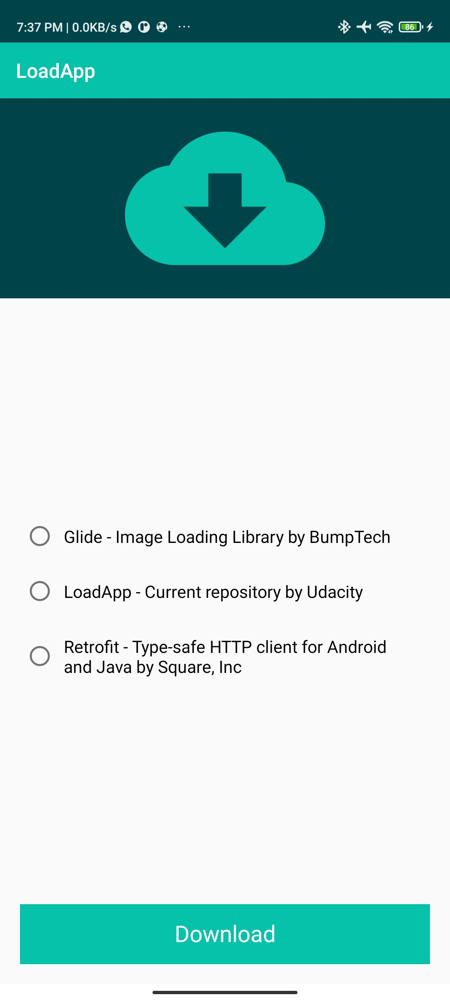
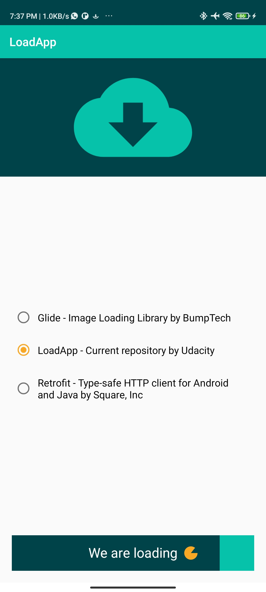
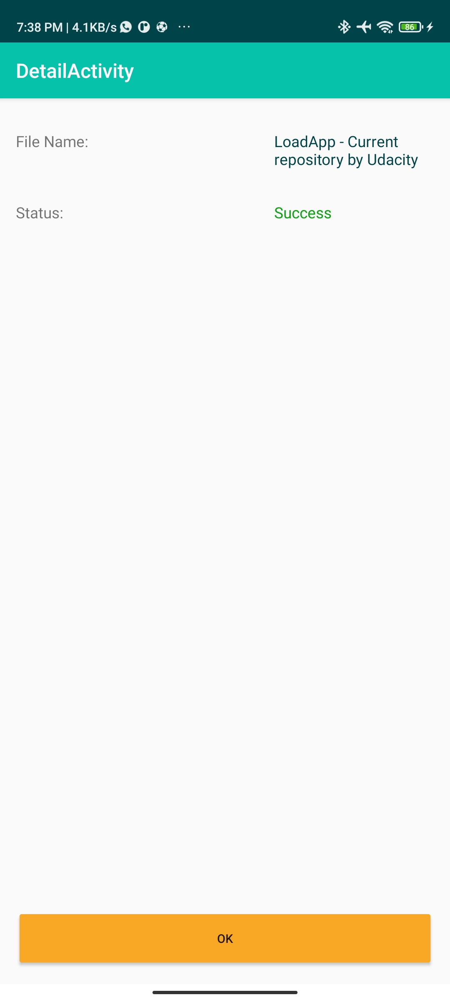

# LoadApp

Loadapp is an app that download a file from the Internet by clicking on a custom-built button where:

- The width of the button gets animated from left to right
- The text on the button gets changed based on different states of the button
- The circle on the button gets be animated from 0 to 360 degrees

A notification will be sent once the download is complete. When a user clicks on the notification, the user lands on detail activity and the notification gets dismissed. In detail activity, the status of the download will be displayed and animated via MotionLayout upon opening the activity.
This  is a project for the Udacity Android Kotlin Nanodegree Program.

## Features
- Custom View Download Button
- Notification

## Prerequisite
To build this project, you require:
- Android Studio artic fox
- Gradle 7.0

## Screenshots
<h4 align="center">

## Author
Babatunde OWoleke

## License
This project is licensed under the Apache License 2.0 - See: http://www.apache.org/licenses/LICENSE-2.0.txt

